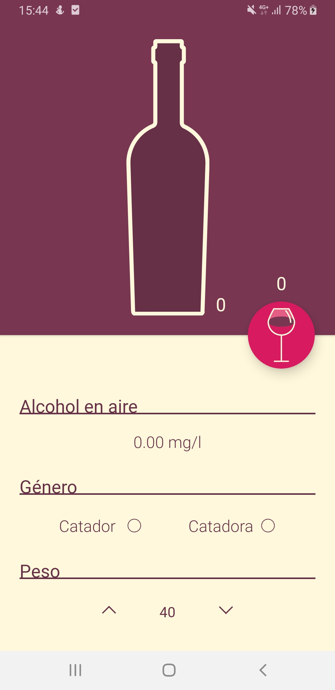
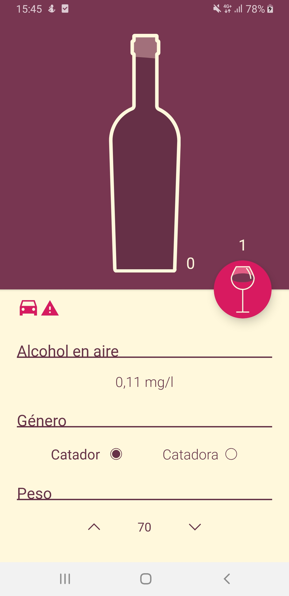
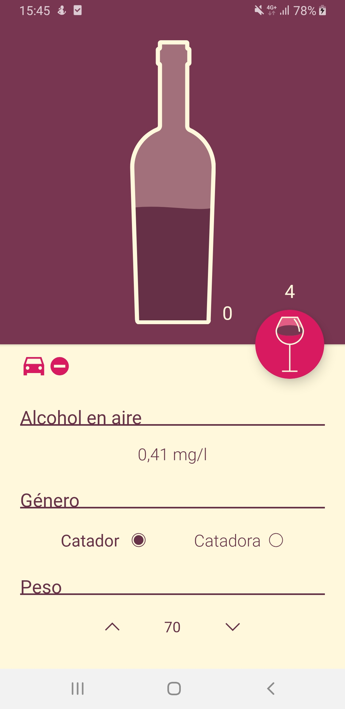
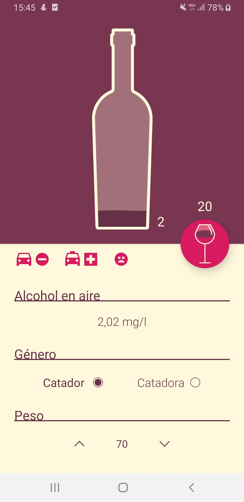
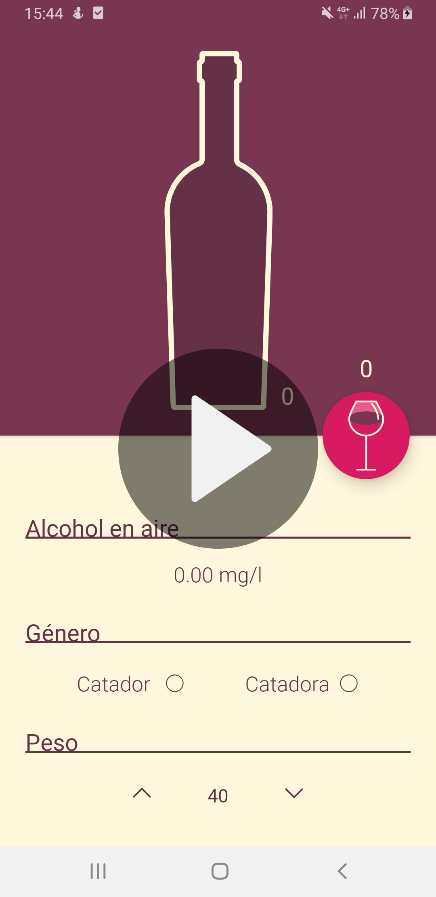

<h1>Winhol</h1>
<h2>Android (Kotlin)</h2>
<b>Main tools</b>
<ul>
<li>Lottie</li>
<li>Dynamic animations</li>
</ul>

<h1>Description</h1>

Winhol is a alcohol in air calculator, base in cups of wine

The idea behind this academic/personal mini project is to experiment with the Lottie Api to create animations and dynamic animations

<h1>Screenshots</h1>

  
  

  
  

<h1>Video</h1>

  

<h1>License</h1>

This repo acts like a portfolio and the app contained here <b>can't hold liability neither place warranty</b>. Furthermore, the final porpouse of this app is not decided yet, so in order to avoid problems in the future this repo has a <b>NonCommercial</b> CC-BY-NC license

 This work is licensed under a <a rel="license" href="http://creativecommons.org/licenses/by-nc-nd/4.0/">Creative Commons Attribution-NonCommercial-NoDerivatives 4.0 International License</a>.
